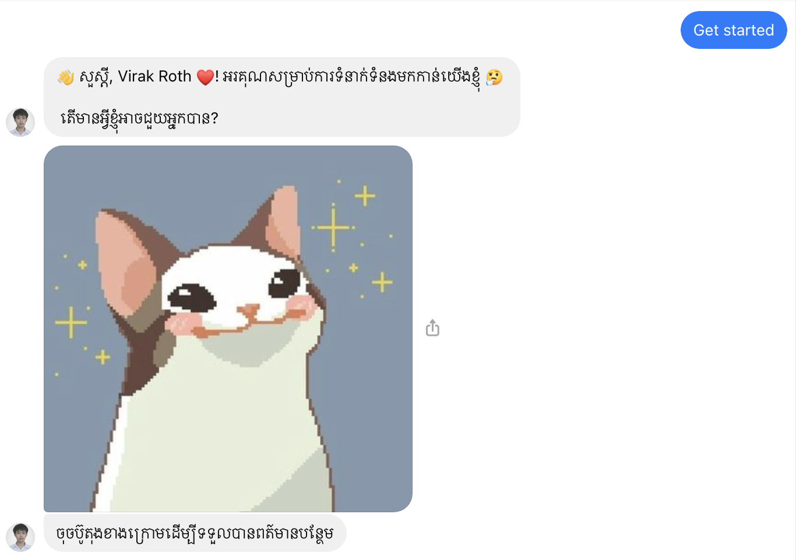
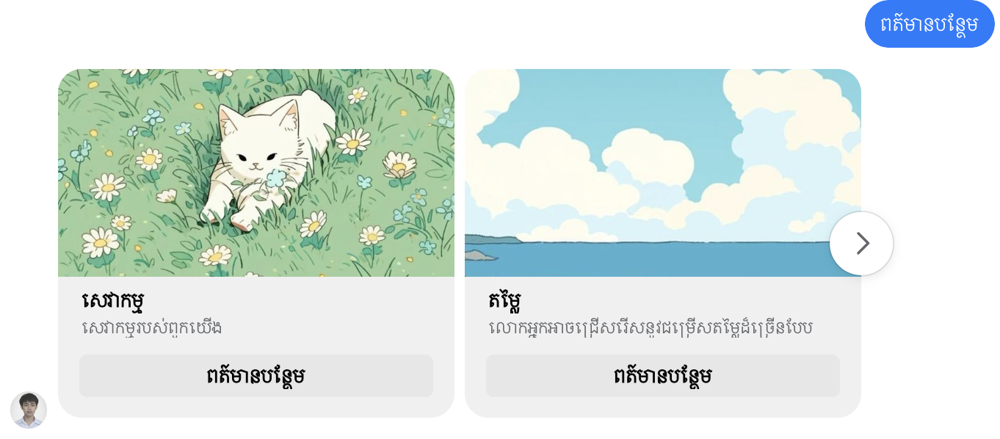
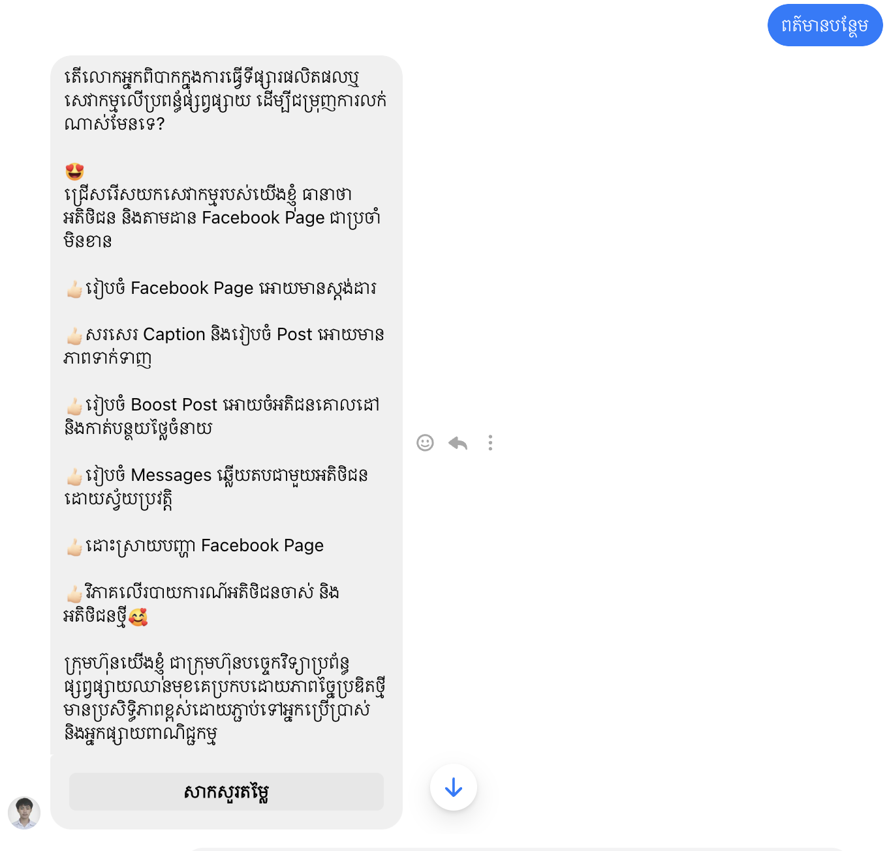
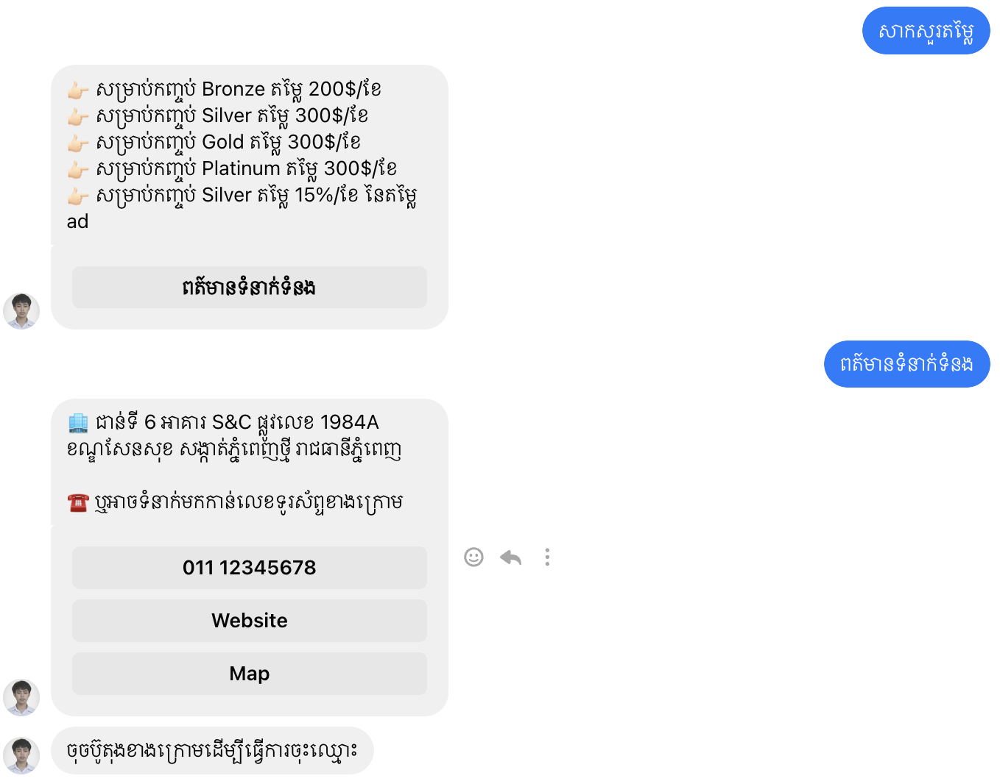
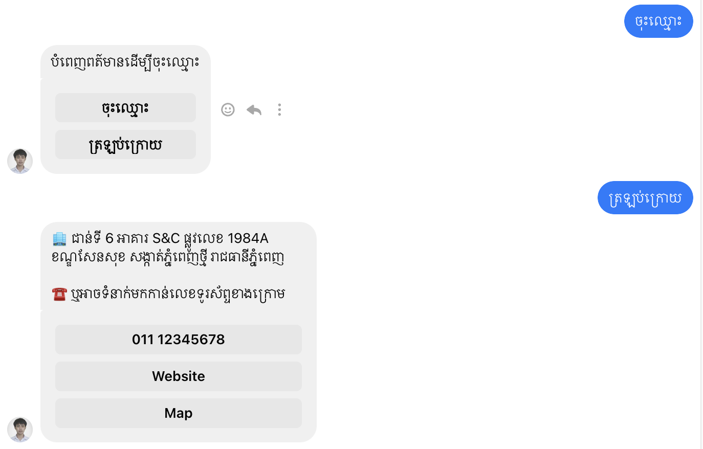
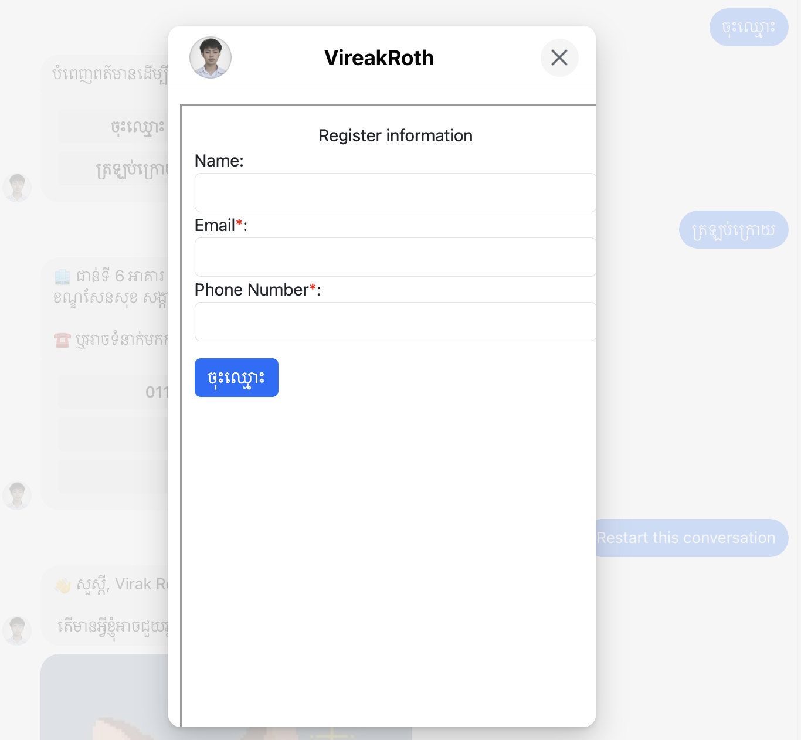
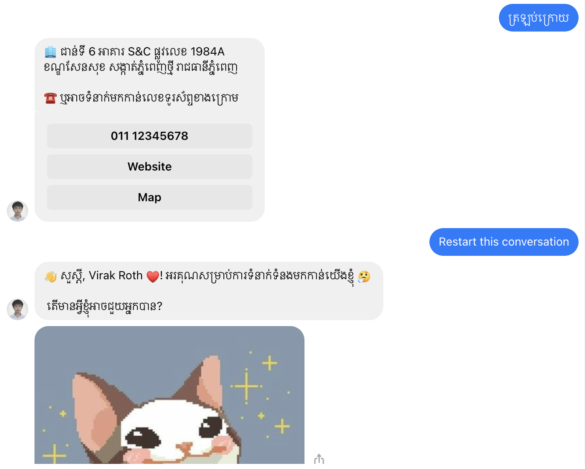

## To SETUP
- `git clone https://github.com/Punvireakroth/AutomateSalesBot.git`
- `npm i`
- `npm start`

### Setup enviroment file
```
PORT=
VERIFY_TOKEN=
PAGE_ACCESS_TOKEN=
```

### App Screenshot









